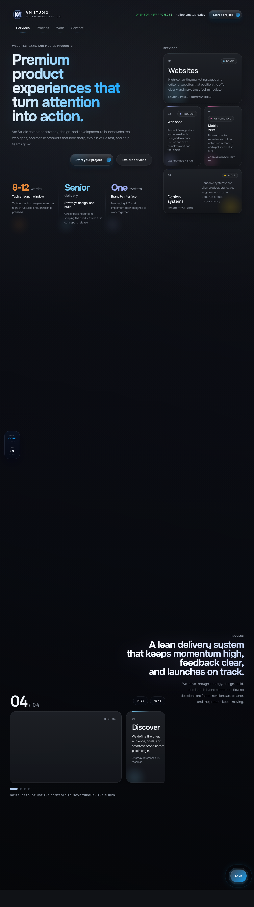
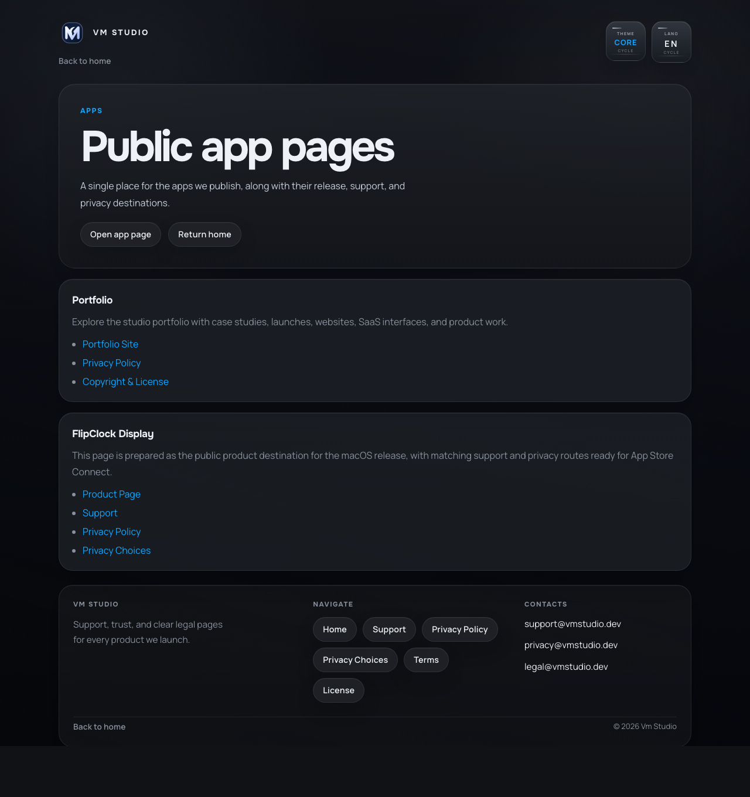
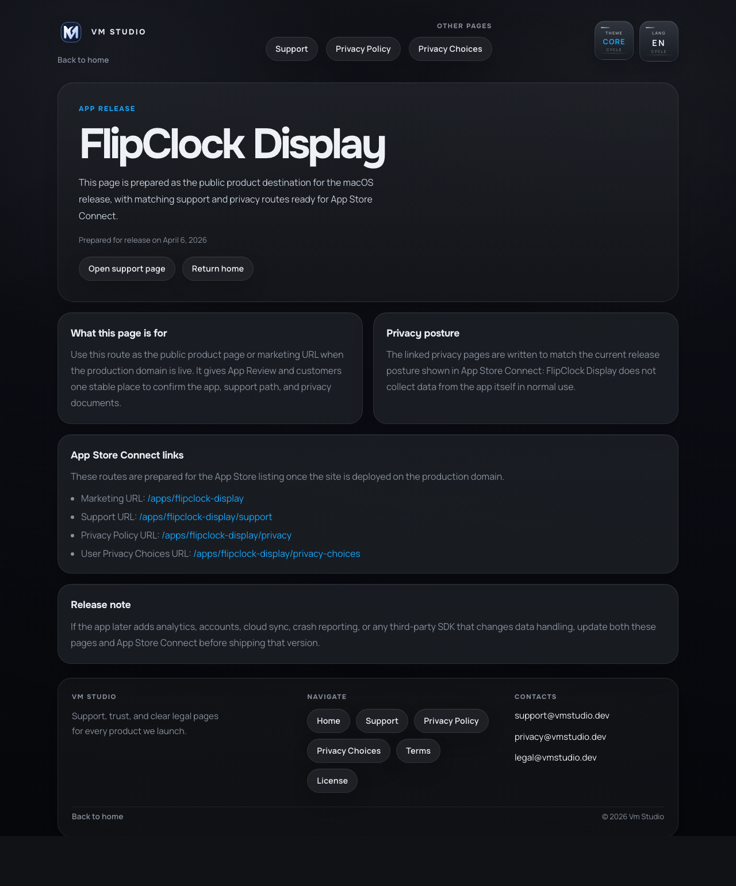
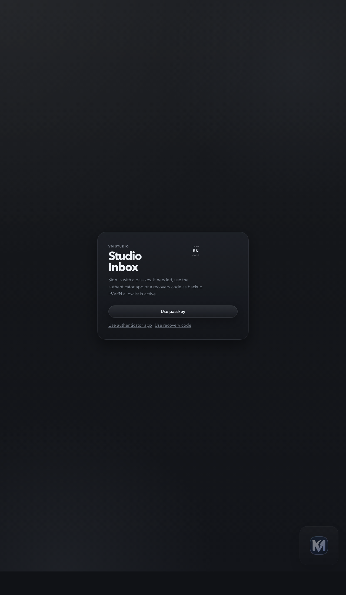
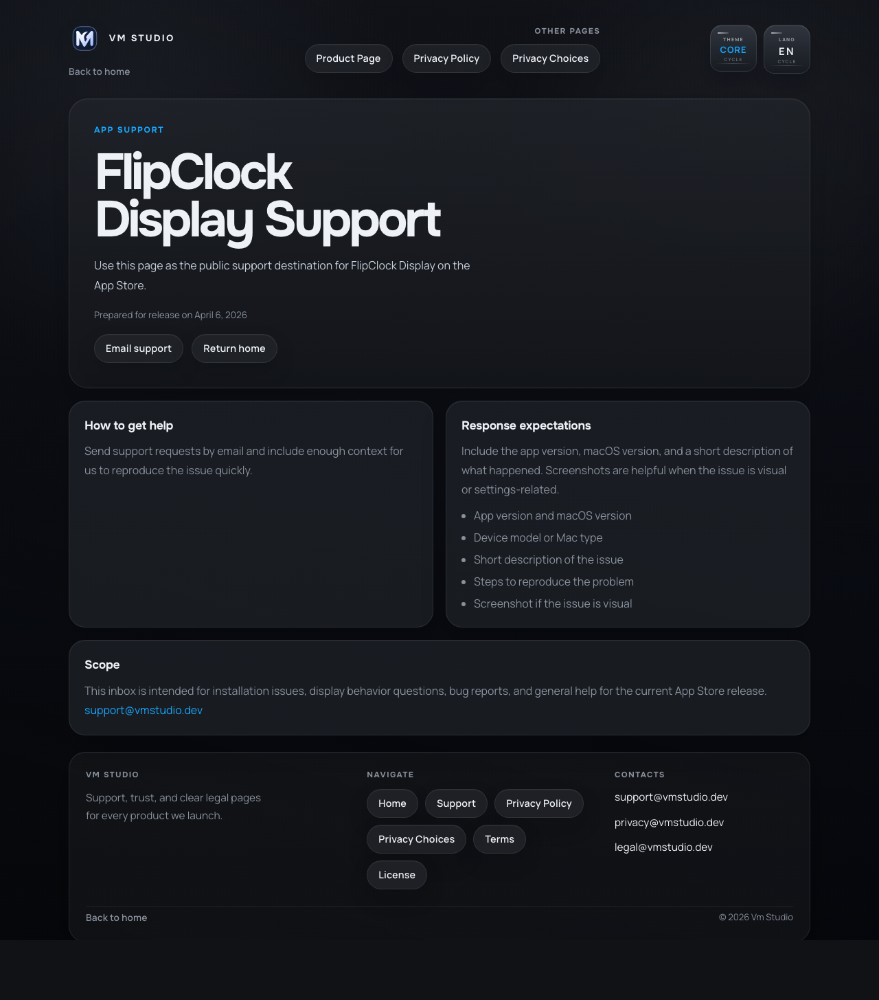
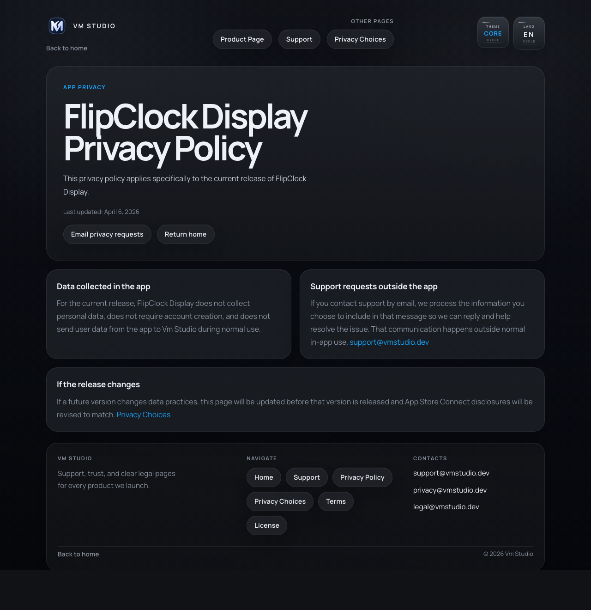

# VMNorth.com

VMNorth.com is a production-oriented multilingual website and product platform for a digital studio. This public portfolio repository is prepared for recruiters, hiring managers, and non-technical reviewers.

The source code is intentionally not included because the project contains private implementation details and production configuration. This repository focuses on the product, architecture, engineering scope, and visible results.

## Live Demo

[https://vmnorth.com](https://vmnorth.com)

## Suggested Live Review Path

- Homepage: [https://vmnorth.com/](https://vmnorth.com/)
- Pricing surface: [https://vmnorth.com/pricing](https://vmnorth.com/pricing)
- Guided brief intake: [https://vmnorth.com/brief](https://vmnorth.com/brief)
- Dynamic work case example: [https://vmnorth.com/work/brand-websites](https://vmnorth.com/work/brand-websites)
- App release surface: [https://vmnorth.com/apps/flipclock-display](https://vmnorth.com/apps/flipclock-display)

## Product Overview

VMNorth.com is more than a static portfolio website. It combines a public marketing experience, product pages, lead intake, visitor communication, admin operations, localization, and production deployment thinking in one cohesive product surface.

Key product areas:

- Multilingual public website with English, French, Spanish, and Russian routes
- Services, pricing, process, regional market, and portfolio project pages
- Guided project brief intake flow for potential clients
- Visitor support chat with session restore and follow-up flow
- Admin workspace for lead handling, saved briefs, analytics review, client observability controls, content copy control, operational health, availability, profile updates, and portfolio publishing
- App catalog with support, privacy, and release-oriented pages
- Production documentation, deployment runbooks, release checklist, and smoke checks

## My Role

I owned the project end to end:

- Product structure and UX flows
- Frontend implementation
- Backend API and persistence design
- Real-time chat behavior
- Admin authentication flow
- Localization model
- Deployment and release process
- Documentation for engineering and hiring review

## Tech Stack

| Area | Stack |
| --- | --- |
| Frontend | React, React Router, TypeScript, Vite |
| Styling | CSS Modules, shared design tokens, responsive layouts |
| Visuals | Three.js, optimized responsive imagery |
| Backend | Node.js HTTP server |
| Realtime | Server-Sent Events |
| Data | PostgreSQL and JSON-backed editable content |
| Auth | Passkey-first admin login, TOTP fallback, recovery codes |
| Email | SMTP/Nodemailer-based notifications and brief submission |
| Delivery | Docker, Docker Compose, GitHub Actions, smoke checks |

## Screenshots

### Homepage



### Apps Catalog



### Product Page



### Admin Sign-In



### Support and Privacy Pages





## Engineering Highlights

- Route architecture supports public pages, localized URLs, legal pages, app release pages, and admin routes.
- Shared layout shells keep header, footer, theme, locale, and support chat behavior consistent across pages.
- Visitor chat supports session restore, message attachments, typing indicators, presence, and SSE updates.
- Admin access is designed around passkeys, with TOTP and recovery codes for account recovery.
- Portfolio content can be edited in the admin workspace and published to public project pages.
- Admin operations include saved brief review, local analytics summaries, client observability controls, audit log, content CMS overrides, release CI status, system health, and backup/retention views.
- Production setup uses a single-origin Node server that serves the built frontend and API routes.
- Release process includes linting, tests, type checks, production build, environment checks, and smoke validation.

## Architecture Snapshot

```text
Visitor / Admin Browser
        |
        v
React + Vite frontend
        |
        v
Node.js same-origin server
        |
        +-- Public route serving
        +-- Chat and brief APIs
        +-- Admin authentication APIs
        +-- Analytics, content, and operations APIs
        +-- Portfolio publishing APIs
        +-- Health and readiness checks
        |
        v
PostgreSQL + JSON runtime files
```

More detail is available in [docs/ARCHITECTURE_OVERVIEW.md](./docs/ARCHITECTURE_OVERVIEW.md).

For a fast walkthrough script, use [docs/DEMO_SCRIPT.md](./docs/DEMO_SCRIPT.md).

## Interview Talking Points

- Built a multilingual React and Node.js product platform with real-time visitor chat and secure admin operations.
- Implemented custom backend flows instead of relying only on third-party widgets.
- Designed admin authentication with passkeys, TOTP fallback, recovery codes, secure cookies, and audit logging.
- Added product operations surfaces for saved briefs, local analytics, content copy, release CI status, health, and retention.
- Prepared the project for production with Docker, environment templates, deployment documentation, and release checks.
- Structured the repository so future engineers could understand routes, runtime boundaries, data ownership, and deployment flow.

## Source Code Note

This public repository is intentionally presentation-only. The source code, production configuration, database files, secrets, and private operational materials are not included.
