# VMNorth.com

**Multilingual digital product studio platform with public sales flows, real-time visitor communication, and a secure operating workspace.**

[Live website](https://vmnorth.com) · [Pricing](https://vmnorth.com/pricing) · [Project brief](https://vmnorth.com/brief) · [Selected work](https://vmnorth.com/work/brand-websites)

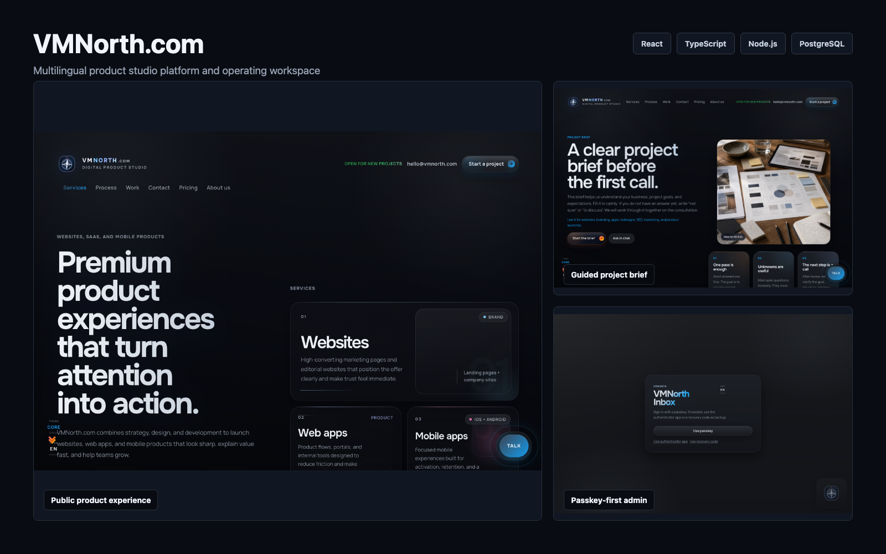

## Product

VMNorth.com is a production-oriented platform for presenting services, converting visitors into qualified leads, publishing project work, supporting app releases, and operating the business from an internal admin workspace.

The public experience supports English, French, Spanish, and Russian routes. The operational side includes visitor chat, saved project briefs, portfolio publishing, analytics summaries, content controls, release status, health monitoring, and account security.

## My Role

**End-to-end product ownership:** product structure, UX, visual system, frontend, backend APIs, persistence, authentication, localization, deployment, release verification, and engineering documentation.

## Core Stack

| Frontend | Backend | Data and realtime | Delivery |
| --- | --- | --- | --- |
| React, TypeScript, React Router, Vite | Node.js HTTP server | PostgreSQL, JSON content stores, Server-Sent Events | Docker, Docker Compose, GitHub Actions, smoke checks |

Additional implementation areas include CSS Modules, Three.js, SMTP notifications, WebAuthn passkeys, TOTP, recovery codes, secure cookies, and audit logging.

## Selected Screens

<table>
  <tr>
    <td width="50%">
      <strong>Commercial pricing surface</strong>  
      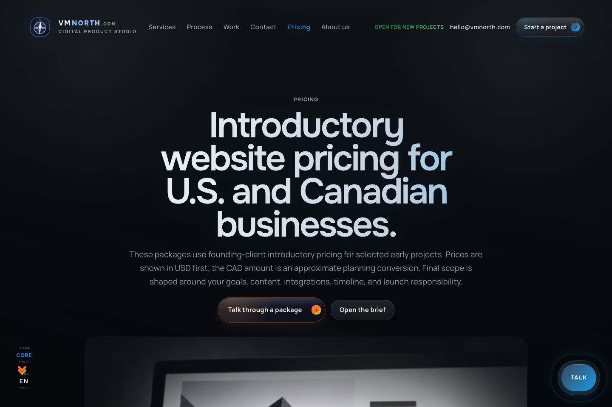
    </td>
    <td width="50%">
      <strong>Guided project brief</strong>  
      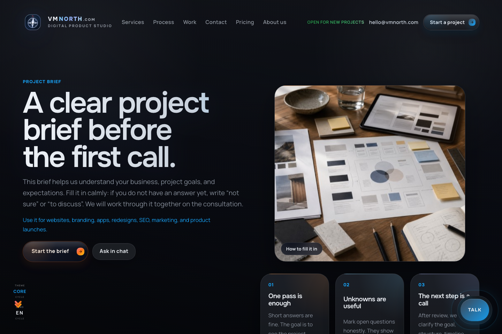
    </td>
  </tr>
  <tr>
    <td width="50%">
      <strong>Dynamic project presentation</strong>  
      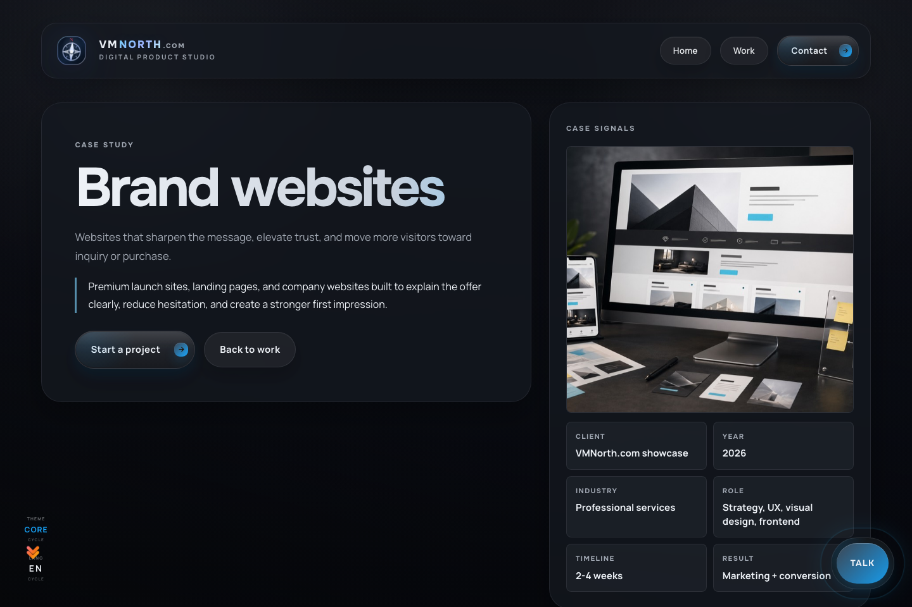
    </td>
    <td width="50%">
      <strong>App release destination</strong>  
      
    </td>
  </tr>
  <tr>
    <td width="50%">
      <strong>Public product experience</strong>  
      
    </td>
    <td width="50%">
      <strong>Passkey-first admin access</strong>  
      
    </td>
  </tr>
</table>

## Mobile Experience

Captured with a real mobile browser context at a `390 × 844` CSS viewport. Each page was verified with no horizontal document overflow.

<table>
  <tr>
    <td width="33%">
      <strong>Homepage</strong>  
      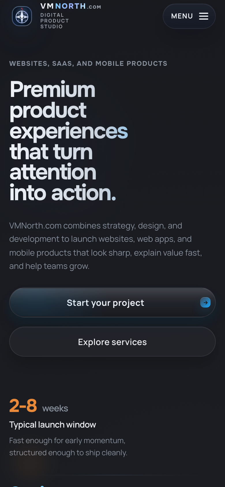
    </td>
    <td width="33%">
      <strong>Pricing</strong>  
      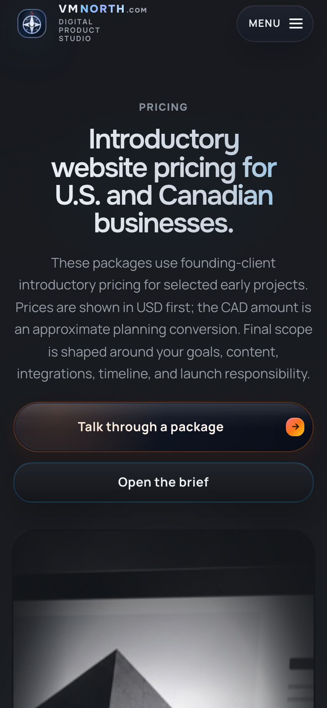
    </td>
    <td width="33%">
      <strong>Project brief</strong>  
      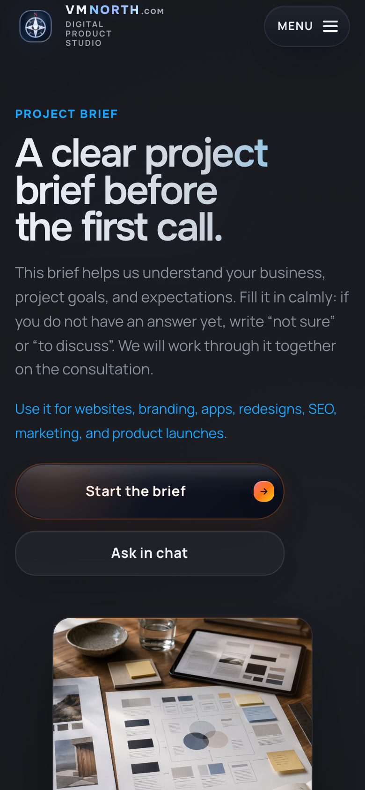
    </td>
  </tr>
  <tr>
    <td width="33%">
      <strong>Selected work</strong>  
      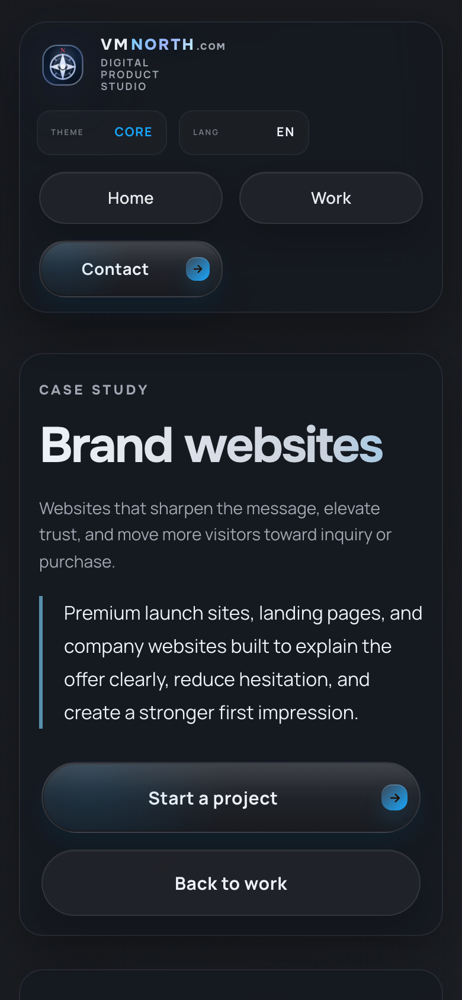
    </td>
    <td width="33%">
      <strong>App release</strong>  
      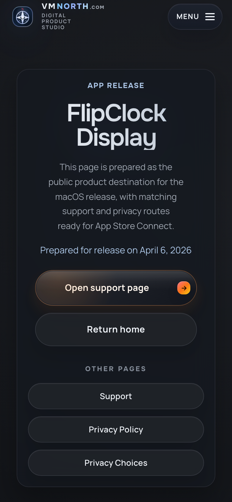
    </td>
    <td width="33%">
      <strong>Admin access</strong>  
      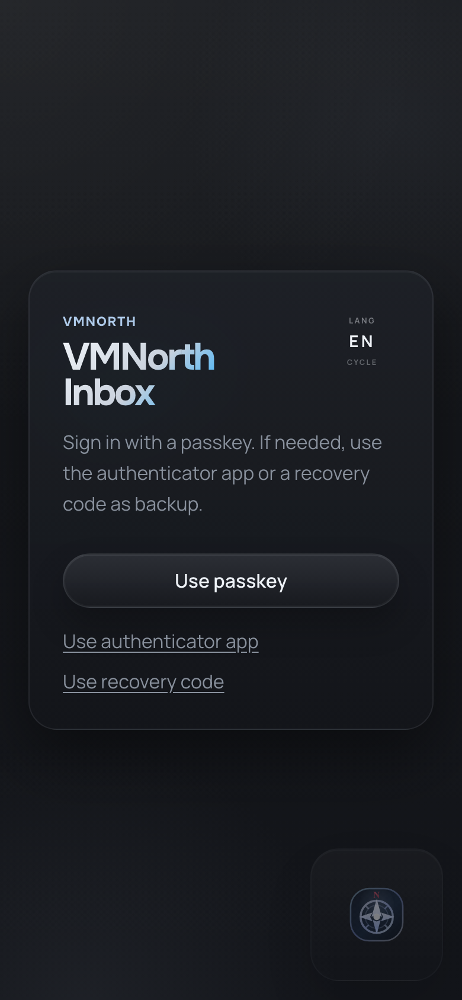
    </td>
  </tr>
</table>

## Product Surfaces

- Public marketing routes for services, process, pricing, regions, and contact
- Dynamic portfolio pages backed by editable project content
- Guided brief intake for structured project discovery
- Visitor chat with session restore, attachments, typing state, presence, and follow-up
- App catalog with product, support, privacy, and privacy-choice routes
- Admin workspace for inbox, briefs, analytics, content, portfolio, releases, and system health

## Engineering Highlights

- Shared route shells keep navigation, localization, theme, support chat, and metadata consistent.
- The Node.js runtime serves the frontend and APIs from one origin.
- Server-Sent Events provide live visitor and admin updates without a third-party chat service.
- PostgreSQL stores operational data; inspected JSON stores support editable content and selected admin state.
- Admin authentication is passkey-first with TOTP and one-time recovery-code fallback.
- Release verification covers linting, tests, type checks, environment validation, production build, performance budgets, and smoke checks.

## System Shape

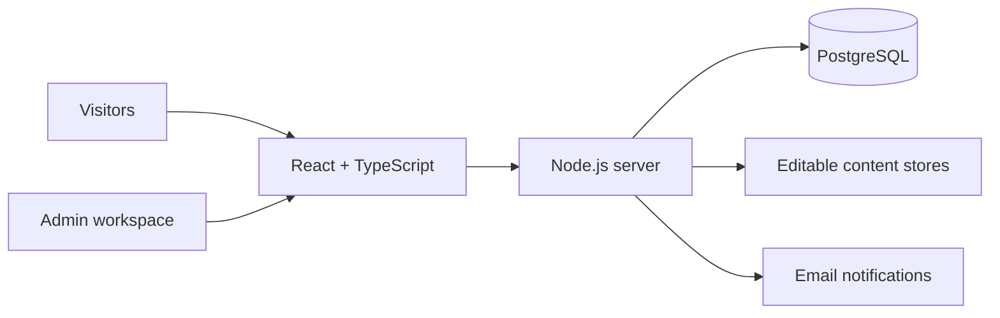

Detailed technical context is available in [Architecture Overview](./docs/ARCHITECTURE_OVERVIEW.md). A short interview walkthrough is available in [Demo Script](./docs/DEMO_SCRIPT.md).

## Source Code

This repository is intentionally presentation-only. Source code, production configuration, databases, credentials, logs, and private operational materials are not public.
